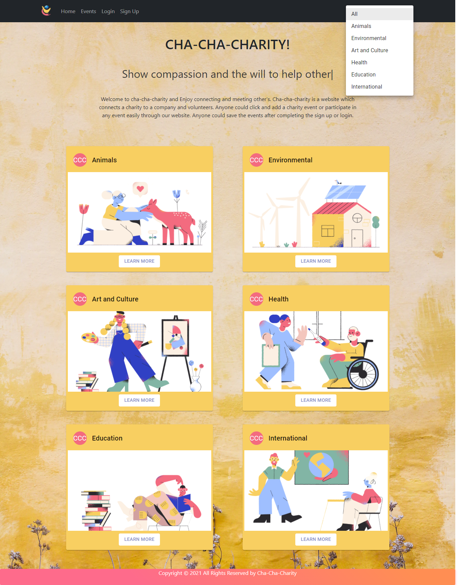
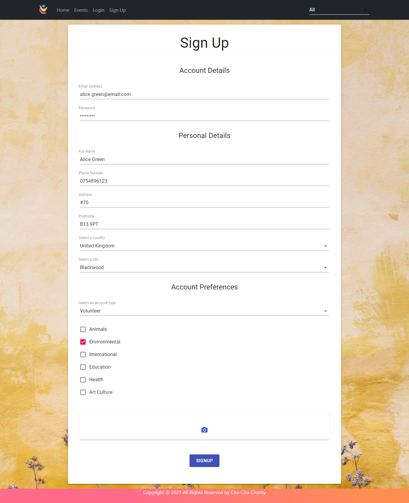
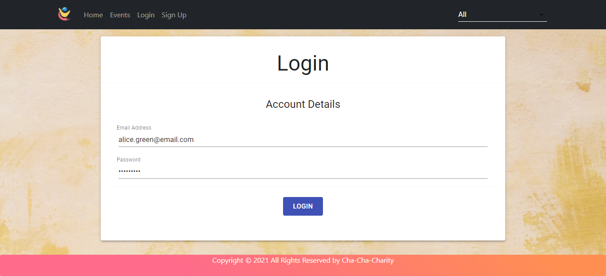
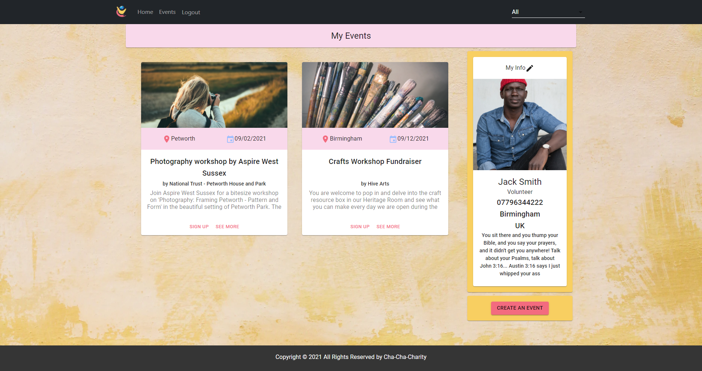
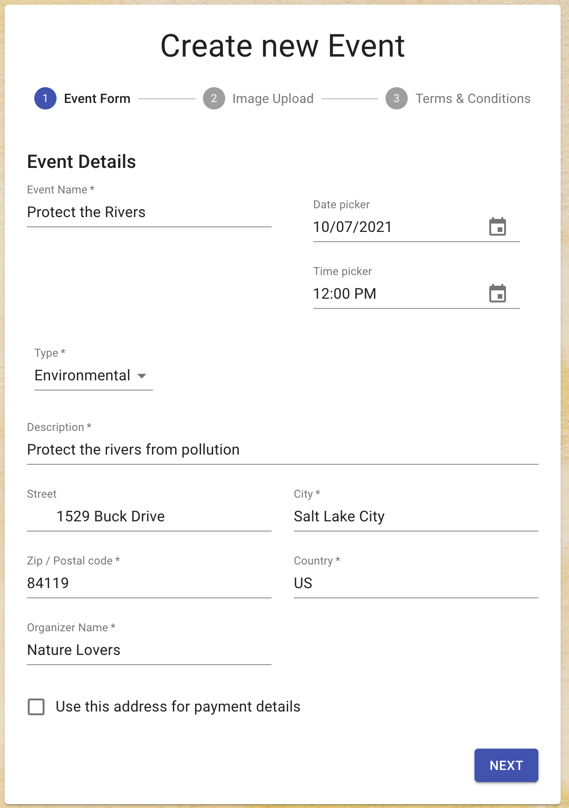
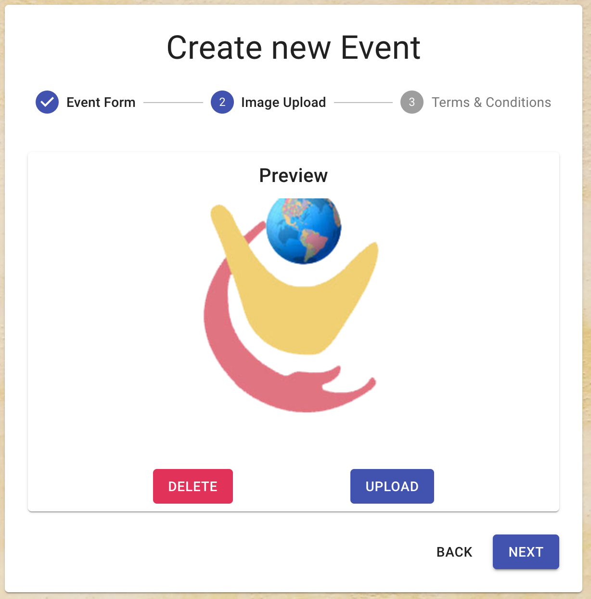
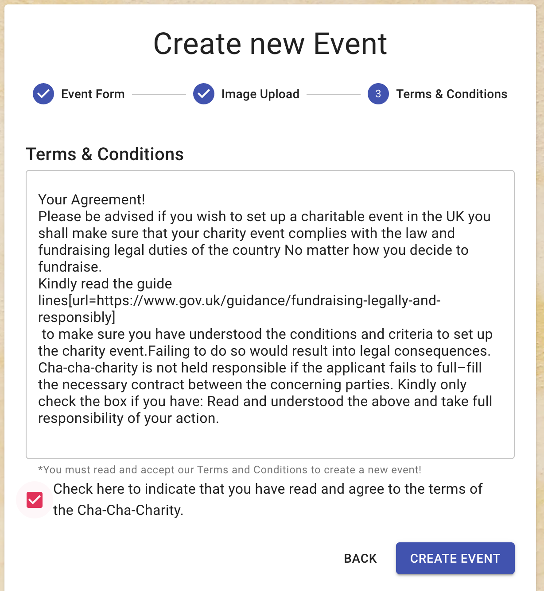

# Cha Cha Charity

- Cha-Cha-Charity is an application which connects everyone together.
- Any volunteer, charity organization or any company could come on our website and click on any charity and they will be shown the related events.
- Anyone could see more information related to the events and then sign up for the same, if they are interested in the same.

## Project link

Click [here](https://aqueous-caverns-38523.herokuapp.com/) to view the server side of the project on Heroku.

Click [here](https://sheltered-ocean-02593.herokuapp.com/) to view the client side of the project on Heroku.

**Contributors**

- Vilma: [Github](https://github.com/vilmaq)

- Otilia [Github](https://github.com/otivisan22)

- Nazim: [Github](https://github.com/MRasheed1991)

- Nazia: [Github](https://github.com/Nrasool21)

- Misha [Github](https://github.com/misha244)
  <br>
- Marcus [Github](https://github.com/marcuslau0903)

- Eti Priya: [Github](https://github.com/Etipriya)

## Table of Contents

- [Cha Cha Charity](#cha-cha-charity)
  - [Project link](#project-link)
  - [Table of Contents](#table-of-contents)
  - [Getting started](#getting-started)
  - [About](#about)
  - [Technology/Framework used](#technologyframework-used)
  - [Running the project](#running-the-project)
  - [Variables](#variables)
  - [Mutations](#mutations)
  - [Project Documentation](#project-documentation)
  - [Objectives](#objectives)
  - [Getting started](#getting-started-1)
  - [Project Charter](#project-charter)
  - [User Journey](#user-journey)
  - [Project Retrospective](#project-retrospective)
  - [Improvements to be made](#improvements-to-be-made)
  - [Results](#results)

## Getting started

```
$ git clone https://github.com/vilmaq/cha-cha-charity
$ cd cha-cha-charity
$ npm i

$ git clone https://github.com/vilmaq/cha-cha-charity-client
$ cd cha-cha-charity-client
$ npm i

```

## About

- Cha-Cha-Charity is an application which helps to connect and bring together everyone in multiple events.
- This is a website on which any user, any company or any charity organization could come and enter the details of any event or participate in any event.

- **Homepage** - Whenever anyone comes to the homepage, they could see the categories with a button "Learn More". As per their choice, they could click on the button of the category of their choice and they will be moved to the next page where various events related to that category will be rendered.



- **Events page** - On this page, anyone could see the various events related to the category clicked.
- **Category** - In the navbar, you could see a button named category. If you click on that, then it shows a dropdown list of various categories. You just need to click on any category and it will show the events related to that category.
- **See More Button** - If any user clicks on the see more button, they will move to a new page where they could see full details related to the category they clicked.

- **Event Detail Page** - On this page, anyone could see the day, date and time about the event and they could register for the same by clicking on the sign up button on that page.
- **Dashboard page** - If anyone comes to this page, they have to enter the personal/official details and also the categories about which they want to get information.
- **Sign up page** - If anyone clicks on sign up button,they will be moved to the sign up page.



- Login page - After sign up, user comes to the login page where they just have to enter their username and password and click on login button.



- **Dashboard** - Whenever user is logged in, they reach dashboard page where they could see create event button and various events for which they have shown their interest.
- Any user could enjoy adding on events to their homepage and they could create multiple events. If there us a charity company or an organization who wants to organize and event and see how many participants are there. It will be easy for them through this website.



- **Create New Event** - Any user could click on the create event button on the dashboard. Then they will be moved to the form where they have to enter few details and click on the "create event" button and that event will be updated.







## Technology/Framework used

- React
- Apollo GraphQL
- Material UI
- React Bootstrap
- React Router Dom
- React Hooks
- React AWS
- Apollo Express

## Running the project

```
$ cd client
$ npm i
$ npm run start

$ cd server
$ npm i
$ npm run dev

```

## Variables

```
{
  "loginInput": {
    "email": "alex.pink@gmail.com",
    "password": "password555"
  },
"signUpInput": {
    "type": "Volunteer",
    "fullName": "Sarah James",
    "password": "password222",
    "email": "sarah.james@gmail.com",
    "phoneNumber": "07796342221",
    "street": "New Street",
    "postcode": "B18 NN",
    "city": "Birmingham",
    "country": "UK"
  },
   "createEventInput": {
    "name": "test",
    "type": "animal",
    "description": "test",
    "day": "2012-02-02",
    "street": "test",
    "postcode": "test",
    "city": "test",
    "country": "test",
    "organizer": "test",
    "creator": "6116bb9faa6c99e1209ac537",
    "user": "61253fb81dd188d6b6950cdd",
    "imageUrl": "test"
  }
  "updateEventInput": {
    "eventId": "612556204c0ea163708a812f",
    "name": "Arizona Poised to Permit Canyon Uranium Mine",
    "description": "An unnecessary uranium mine near the Grand Canyon poses a threat to fragile water resources and shouldn’t be allowed to continue",
    "street": "New Street",
    "postcode": "B2 3DF",


  }
}


```

## Mutations

```
mutation Mutation($signUpInput: SignUpInput!) {
    signUp(input: $signUpInput) {
      token
      user {
        type
        id
        fullName
        password
        email
        phoneNumber
        street
        postcode
        city
        country
        imageUrl
        bio
        animals
        environmental
        international
        health
        education
        artCulture
      }
    }
  }

```

```
mutation Mutation($loginInput: LoginInput!) {
    login(input: $loginInput) {
      token
      user {
        id
        email
        password
      }
    }
  }

```

```
mutation Mutation($updateEventInput: UpdateEvent!) {
  updateEvent(input: $updateEventInput) {
    id
    name
    description
    postcode
    street
    }
  }
}

```

## Project Documentation

Cha-Cha-Charity is interesting and it connects everyone in a single website.

- Cha-Cha-Charity is an application which connects everyone together. Any volunteer, charity organization or any company could come on our website and save the events in which they are interested. They could save selected events in their homepage and view the details at any point of time.
- Anyone could create events and see the day and date of that event, participate in an event and also see the number of participants in that event.

## Objectives

- Interesting - let user to create event with day and date.
- Allow user to save their events for future.
- Enhance user experience by adding and saving multiple events.

## Getting started

We started with the project with the following steps:

```
$ cd server
$ npm i
$ npm run dev

$ cd client
$ npm i
$ npm run start

```

## Project Charter

Cha-Cha-Charity is a wonderful website which brings everyone together. It gives an exposure to every individual and of any age.

**Key requirement** - tasks, roles and responsibilities were allotted at the starting of the project.

**We used:**

- React
- Apollo GraphQL
- Material UI
- React Bootstrap
- React Router Dom
- React Hooks
- React AWS
- Apollo Express

## User Journey

**Easier to use** - Our website is easily accessible and easy to user for any charity organization, volunteer and organization.

**Make a search** - User could use this website easily on his mobile, tablet or computer and participate in any event according to their interest, by clicking on any category of event.

**Personal Information** - User could see their name, address and contact number on the dashboard when hey sign in.

**Create Events** - User could also create events in the dashboard by adding information related to the event details in an event form, image upload and then just ticking the terms and conditions and then clicking on "Create event" button.

**Delete or upload an image** - It is easy to delete or upload an image while creating an event. User just needs to click on the button "Delete" or "upload and the same action will be done.

## Project Retrospective

- Cha-Cha-Charity is a wonderful platform which helps people come together and collect for a charity.
- It is an interactive app which depends on the interest of people in charity.
- It connects human of any age and organizations and bring them together.

## Improvements to be made

This project could be improved by adding

- Connect to stripe for donations.
- Pre Process legal documentation of a registered charity.
- Adding a delete and upload event button.
- Connect with other website's like WhatsApp, Instagram and Twitter.

**Lessons learnt**

We learned about various things:

- Related to Apollo GraphQL.
- Legal challenges
- Creating models

**Timeline**
Every task was given a limited time and whole team has been into the project. So, everyone completed the task and helped each other in a great manner.

## Results

**Objectives were achieved as below:**

- Any Volunteer,Charity or Business could easily access the application and participate or host into various events related to charity.

- Anyone could participate in various charitable events and can also create their own event.

- It adds the selected events to the dashboard page.

- It easily delete or update the events by clicking on "Delete" button and "update" button while creating an event.

- It shows selected events in which any user wants to participate or volunteer on the dashboard.

- It easily comes back to the home page.

- It easily allows to sign up, login and logout.
